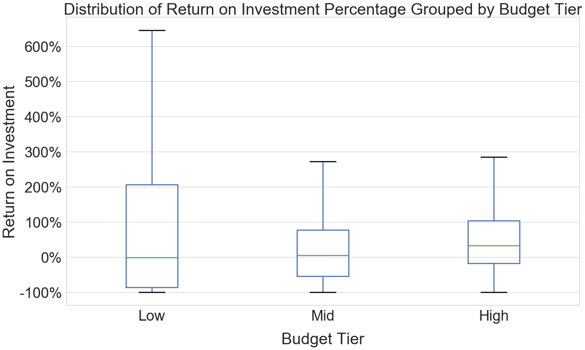
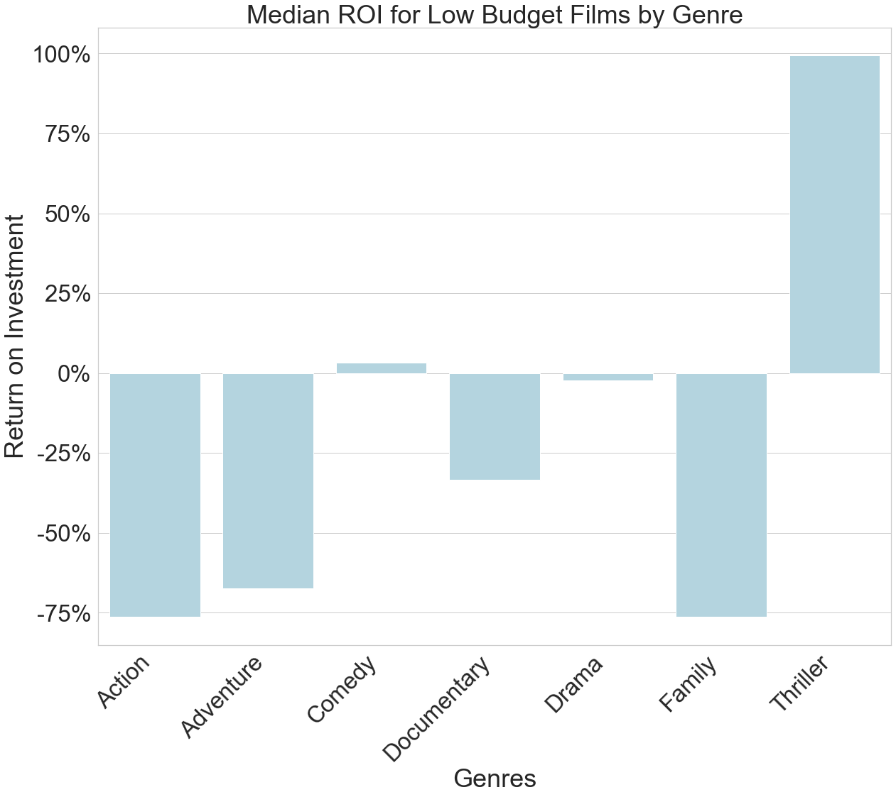
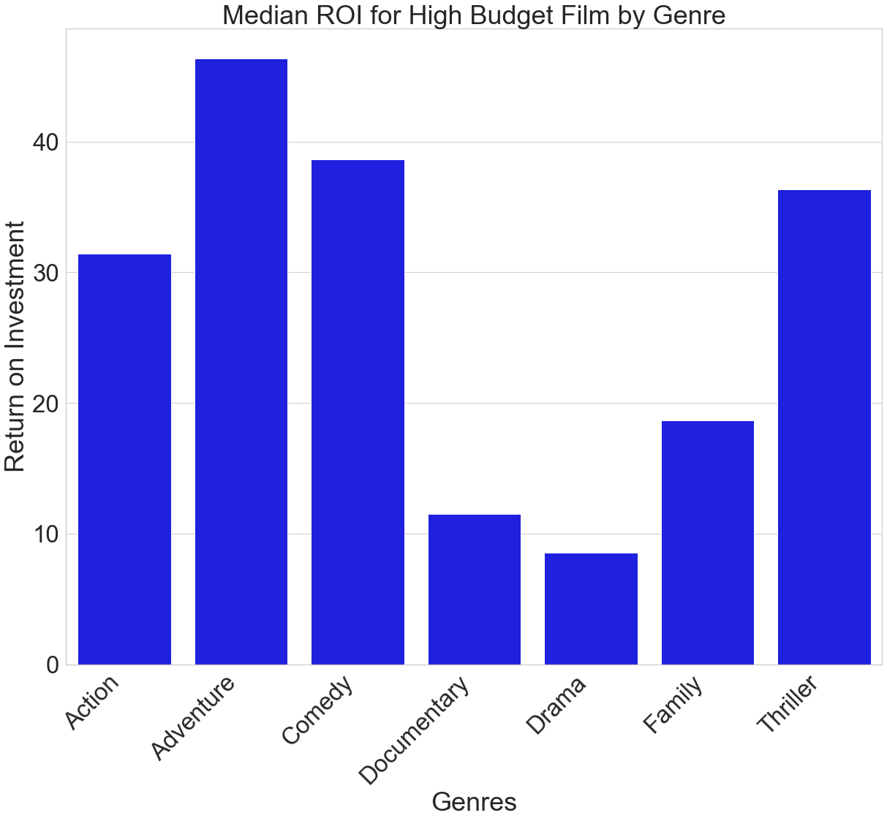

# Analysis of Film Industry ROIs
**Authors**: Malcolm Katzenbach, Lauren Phipps, Dan Valenzuela

## Repository Structure

```
├── README.md                           <- The top-level README for reviewers of this project
├── Project_Walkthrough.ipynb           <- Narrative documentation of analysis in Jupyter notebook
├── Film_Analysis_Presentation.pdf      <- PDF version of project presentation
├── Cleaned_Data.csv                    <- CSV of data used for analysis
├── CustomLibrary.py                    <- Module of function used in analysis
├── data                                <- Sourced externally and generated from code
├── images                              <- Both sourced externally and generated from code
├── notebooks                           <- Noteboooks used to build Walkthrough
└── templates                           <- Templates referenced in building project
```


## Overview

Microsoft wants to get into movie production. This project analyzes the budgets and returns on investment (ROI) for movies ranging from 2010-2019, in order to help determine which types of movies they should create. Using data from the Internet Movie Database and The-Numbers.com, the movies were broken down into genre and budget categories to determine any trends in returns on investment. This information will be used to help Microsoft's new movie studio maximize their success by selecting genres and budget tiers that will yield the highest return on their investment. This project found that, if looking to invest in a low budget film, they should create thriller movies. If they are looking to invest in a high budget film, they should create adventure movies. These genres will maximize their return on investment at those budget tiers. 


## Business Problem

Many large companies have started to venture into creating original video content. Seeing the potential and wanting to be able to compete with other companies, Microsoft has created a new movie studio. In an effort to be as successful as possible, research must be done into the movie industry to determine what conditions will yield the highest return on investment. Microsoft's goal is to maximize their return on investment for the movies they create. 

The business questions that will be addressed are:

  1) What is the relationship between a film's budget and it's return on investment?

  2) What is the distribution of returns on investment for budget tiers for films?

  3) What is the distribution of returns on investment for movie genres?

  4) Which budget tier for each genre will yield the highest median return on investment?

Answering these questions will allow the project to provide specific recommendations for the budget tier and genre of the movie for Microsoft to create in order to maximize their return on investment. 


## Data Understanding
For the purposes of this analysis, we focused primarily on data from the Internet Movie Database (IMDB) and The-Numbers.com (TN), two sources that specialize on the film industry. Specifically, we used two datasets that included--in one--title, date released, and genre data and--in the other--title, date released, production budgets, and box office figures. Below is a summary of the data pertinent to our analysis broken down by file. 

| imdb.title.basics.csv | tn.movie_budgets.csv |
| --- | --- |
| primary_title | movie |
| start_year | release_date |
| genres |  |
|  | production_budget |
|  | domestic_gross |
|  | worldwide_gross |

## Data Preparation
In order to begin the analysis on the collected data, a few operations need to be performed. The most important operation being the addition of a `start_year` column to the TN data so that both the IMDB and TN datasets can be more effectively merged. By creating a new integer column by slicing `release_date`, a merged dataset can be made based on movie title (`movie`) and `start_year`. Merging on both title and date prevents erroneous data arising from remakes or different movies with the same title. 

After merging the data, key cleaning operations included removing duplicates, dropping any movies without `worldwide_gross` data,  calculating `ROI`, parsing out `genre` data, and converting revenue data into integers for analysis, and categorizing budgets.

## Results

### Distribution of ROI for Budget Tiers


This graph shows that the median is highest for high budget films and that only a small percentage of those movies have a negative ROI and would lose money. They are the safest investment to get a positive ROI. Low budget films do have the highest portion of movies that will lose money, but at the same time, have the highest range of positive ROI's. The upper end of the box denotes the 75th percentile and that is at 200%, while the whiskers denoting the 90th percentile is significantly higher at over 600% return. This shows that there is potential to get a very high return on an investment in a low budget film.


### Median Returns on Investment for Low and High-Budget Films, Grouped by Genre



This graph shows that, for low budget films, most genres do not have a positive median ROI. The exception is for low-budget thriller films. These yield a median ROI of 100%, which corresponds with doubling the initial investment in the film.



High budget films across all genres yielded a positive ROI, with adventure, comedy, and thriller films yielding the highest. This graph confirms that most films that have a budget of over $100 million will have a positive return on that investment.

## Evaluation

The overall business problem that was given asked how a new movie studio may be as successful as possible in terms of ROI. By looking more deeply into the data on movies from the past 10 years, the analysis has shown what types of genres have done well with certain sized budgets. This has successfully answered the main question in a basic way. This analysis is helpful as done, however, there are certain areas that could bring more accuracy to the analysis. 

- **The Advertisement Cost**: In the analysis, it was assumed that advertisement budget was equal to the production budget. However, it unlikely that all movies had an equal advertisement and production budget. By using more accurate advertisement budgets, the accuracy of the ROI will increase.
- **Time Period of Analysis**: The dataframes were only for movies from the last 10 years. While useful for immediate future movies, having a longer period of data could increase how robust our analysis is and could allow us to see trends over time.
- **Inflation**: This analysis did not account for inflation. While only over a 10 year period, the inflation would have an effect on the money values of older movies, which would increase the accuracy of the comparison between  movies.
- **Box Office Only**: This data only takes into account box office revenues. If Microsoft desired to go into streaming services and produce movies for the streaming service only, it would be more accurate to include data on streamed movies.
    
    
## Conclusion

This analysis of ROI across budget tiers and genres brings forward two recommendations:

**Produce high budget adventure films-** if the studio has a high production & advertisement budget, it would make sense for the studio to invest in an adventure film since it had the highest median ROI for high budgets.

**Produce low budget thrillers-** if the studio has a low budget, it would make sense for the studio in thrillers since they have the highest possible ROI of any genre film with low budgets. 

## Next Steps

Based on our evaluation and conclusion, there are multiple paths for further analysis. We suggest the following three possible avenues:

**Evaluating personnel that maximize ROI-** By analyzing the personnel of successful movies in genres such as thrillers and adventures, the studio could attempt to hire those that would most likely help produce a movie with a high ROI.

**Find accurate advertisement budgets for movies and account for inflation-** By going back into the analysis and improving cost data, the accuracy of the ROIs could be increased.

**Constructing Portfolios of Films-** With a given studio budget, a portfolio of films could be maximized for ROI by genre and budget for each.
